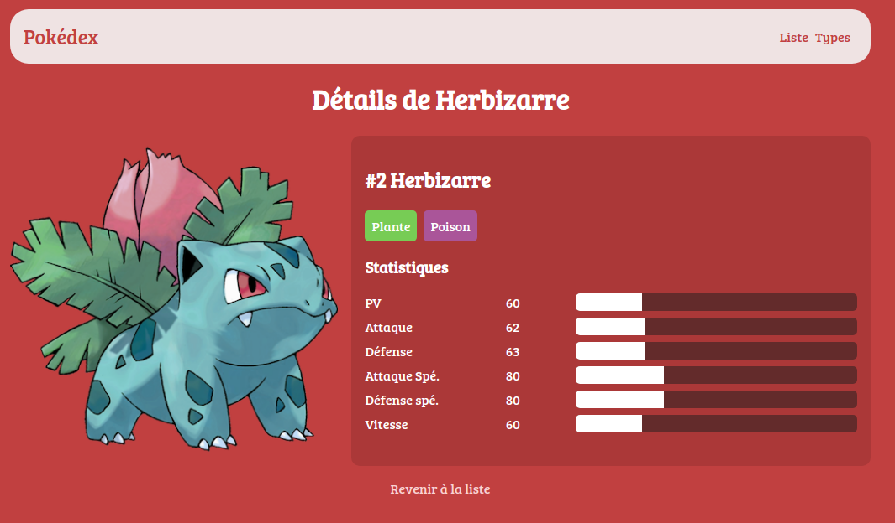

# Pokédex

Lors d'un atelier pendant ma formation nous devions mettre en place un pokédex, nous avions à disposition un import SQL contenant la liste des pokémon et leurs types .

Un pokédex est une sorte de dictionnaire de tous les pokémon (petites créatures fictives et adorables). Ces derniers peuvent se battre
et disposent de caractéristiques de combat appelées statistiques. Chaque pokémon possède aussi un ou deux types (plante, roche, feu...).

Nous avions pour consigne d'utiliser les outils suivants : 
- PHP
- MySQL
- HTML et CSS
- Composer
- AltoRouter

# Instructions 

Nous avions pour consigne de réaliser: 

- Une page d'accueil qui liste tous les pokémon de la base (home.png)

- Une page détail d'un pokémon qui affiche son type et ses stats (detail.png)

- Une page qui liste les types de la base (types.png) quand on clique sur l'un on arrive sur la page suivante

- Une page qui liste les pokémon filtrés par le type cliqué sur la page précédente (electrik.png)

